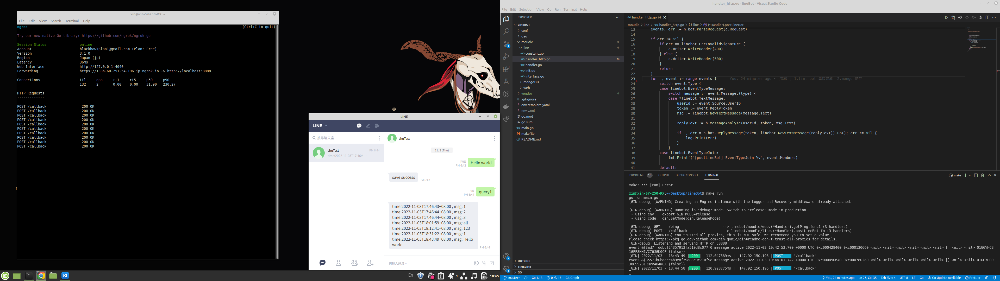
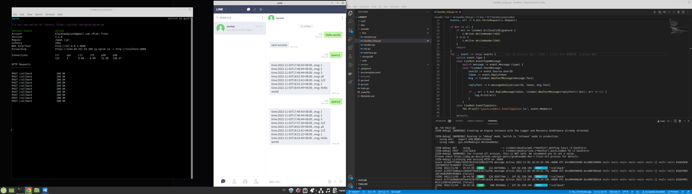

# lineBot
lintBot &amp; mongo 練習

## 成果
1. 啟動 ngork hppt port
    1. port 是 env 的 port 需要跟web相同
    1. Line Webhook settings 放入 ngork Forwarding
1. 在line裡面發送訊息並存入DB 

1. 搜尋此會員已經發送過得消息(1天以內)

1. 搜尋此會員已經發送過得消息(2天以內)
    * 天數可以自行設定
